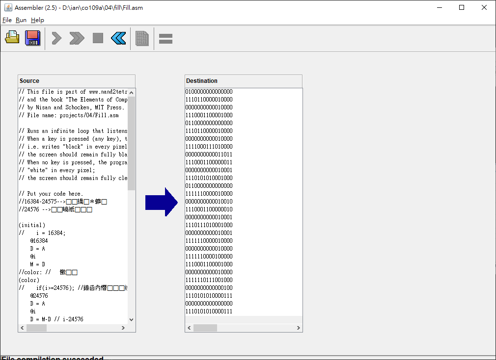
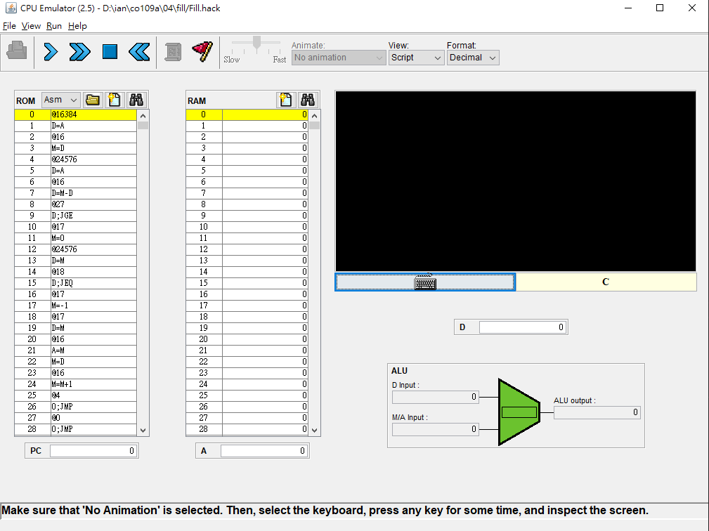

# Fill.asm

* 先寫c做測試 
<pre>

//16384-24575-->螢幕顯示
//24576 -->偵測鍵盤

initial://  i設回16384為螢幕顯示第一號
    i = 16384;
color: //   顏色
    if(i>=24576); //壓下任意鍵
    goto leavefor; 

    int  color1 =0 //白色
    if(M[24576] ==0){//放開鍵盤時
        goto NEXT
    }
    color1 = -1//黑色

NEXT://逐一對16384-24575的位置設值 0或-1
    M[i] = color;
    i++;
    goto color;

leavefor:
    goto initial;
</pre>

* 轉為組合語言

<pre>
//16384-24575-->螢幕顯示
//24576 -->偵測鍵盤

(initial)
//    i = 16384;
    @16384
    D = A
    @i
    M = D
//color: //   顏色
(color)
//    if(i>=24576); //表示壓下任意鍵
    @24576
    D = A
    @i
    D = M-D // i-24576
    //  goto leavefor; 
    @leavefor
    D;JGE

//    int  color1 =0 //白色
        @color1
        M =0
//    if(M[24576] ==0){//放開鍵盤時
        @24576
        D = M
        
//        goto NEXT
        @NEXT
        D;JEQ
//    }
//    color1 = -1//黑色
    @color1 
    M = -1
//NEXT:
(NEXT)
//    M[i] = color1;
    @color1
    D = M //D = M[color1]
    @i
    A = M //i = M[i]
    M=D  //M[i]  = color1
//    i++;
    @i
    M = M+1
//    goto color;
    @color
    0;JMP

//leavefor:
(leavefor)
//    goto initial;
        @initial
        0;JMP
</pre>

* 帶入Fill.asm做測試 先使用Assembeler.bat 轉換為 Fill.hack

* 接著用CPUEmulator.bat做測試

