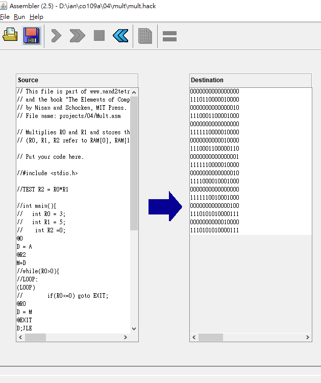
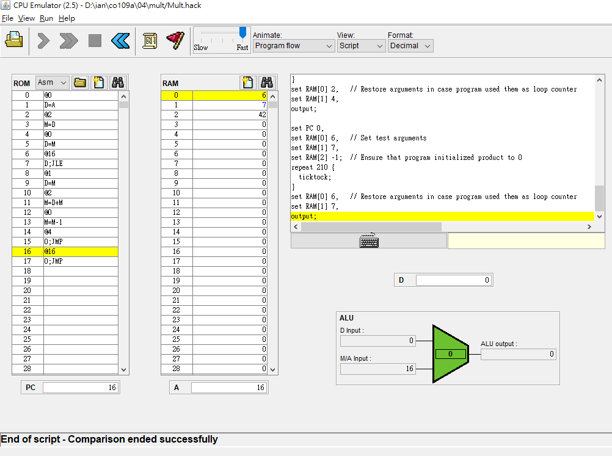

# Mult.asm

* 先寫c做測試 
<pre>

#include <stdio.h>
//R2 = R0*R1

int main()
{
    int R0 = 3;
    int R1 = 5;
    int R2 =0; 
    
    //while(R0>0){
LOOP:
        if(R0<=0) goto EXIT;

        R2 = R2+R1;
        R0 = R0-1;
        printf("R0 = %d R1 = %d R2 = %d\n",R0,R1,R2);
        goto LOOP;
    //}

    EXIT:
        printf("R2 = %d",R2);
      
}
</pre>

* 逐一轉換為組合語言

<pre>
//#include <stdio.h>

//TEST R2 = R0*R1

//int main(){
//   int R0 = 3;
//   int R1 = 5;
//    int R2 =0;
@0
D = A
@R2
M=D    
    //while(R0>0){
//LOOP:
    (LOOP)
//        if(R0<=0) goto EXIT;
@R0
D = M
@EXIT 
D;JLE //D<=0 JUMP TO EXIT
//        R2 = R2+R1;
@R1
D = M
@R2
M = M+D
//        R0 = R0-1;
@R0
D = M
D = D-1
//        printf("R0 = %d R1 = %d R2 = %d\n",R0,R1,R2);
 //       goto LOOP;
    //}

//    EXIT:
     (EXIT)
     @EXIT
     0;JMP
//        printf("R2 = %d",R2);
      
//}
</pre>

* 帶入mult.asm做測試 先使用Assembeler.bat 轉換為 mult.hack

* 接著利用CPUEmulator.bat做測試

