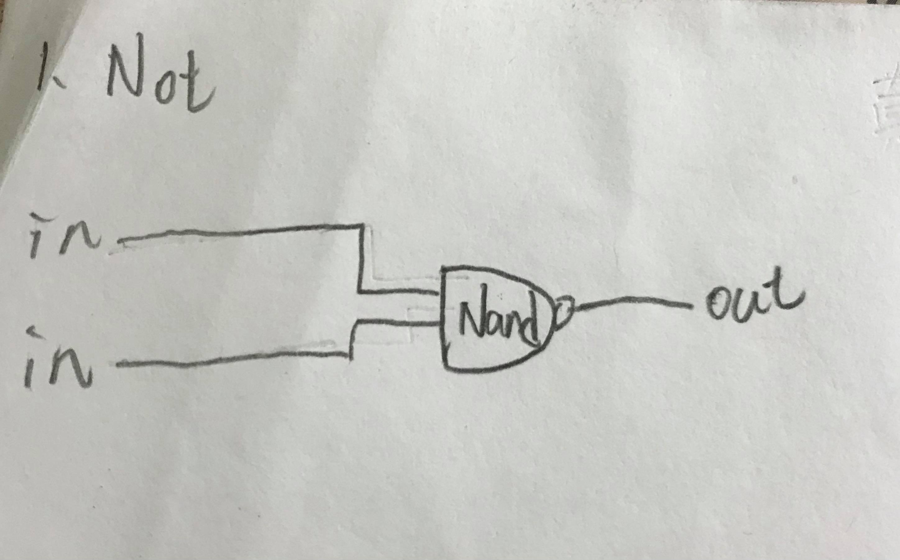
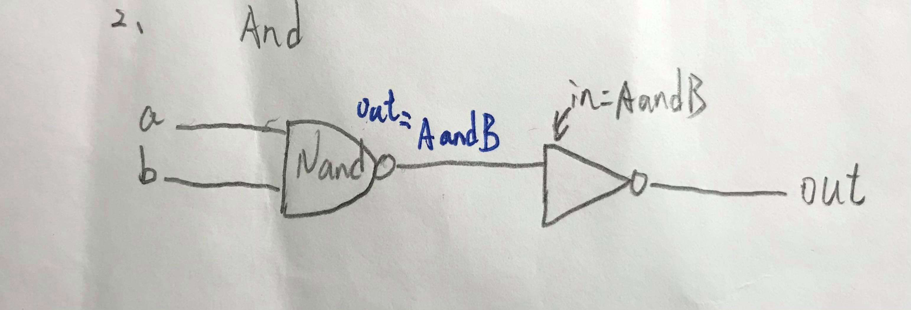
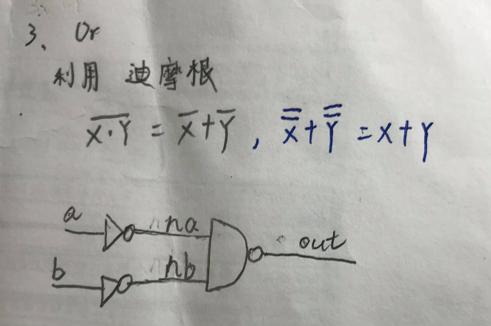
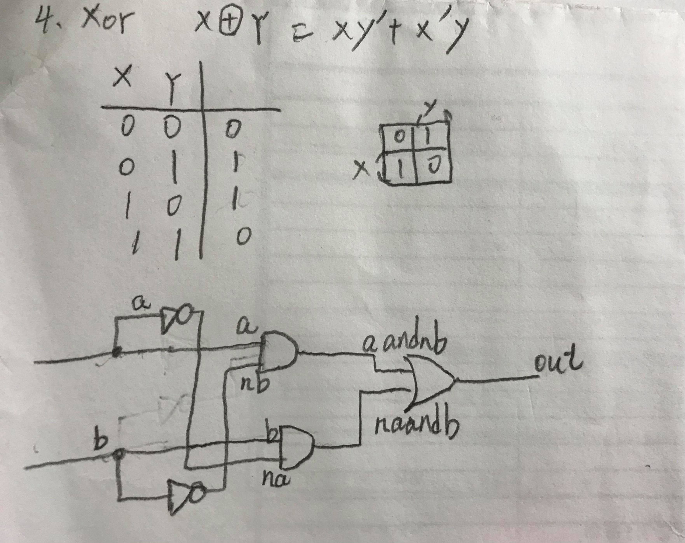
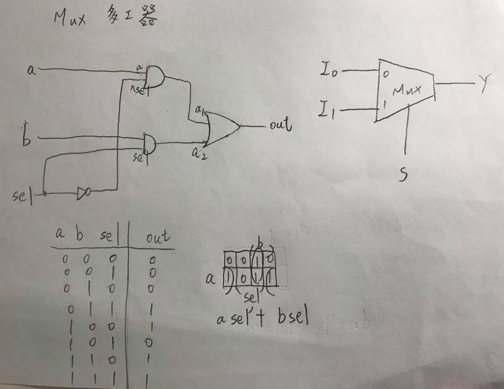
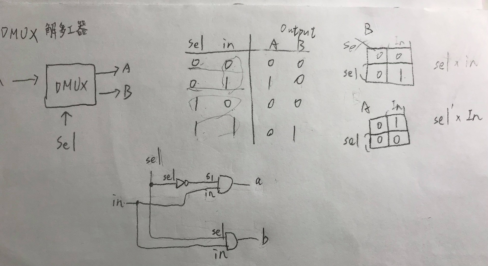

# 第一章前六題

## Not
* code
<pre>
// This file is part of www.nand2tetris.org
// and the book "The Elements of Computing Systems"
// by Nisan and Schocken, MIT Press.
// File name: projects/01/Not.hdl

/**
  Not gate:
  out = not in
 */

CHIP Not {
    IN in;
    OUT out;

    PARTS:
    // Put your code here:
    Nand(a=in, b=in, out=out);
}
</pre>

## And

* code
<pre>
// This file is part of www.nand2tetris.org
// and the book "The Elements of Computing Systems"
// by Nisan and Schocken, MIT Press.
// File name: projects/01/And.hdl

/**
 * And gate: 
 * out = 1 if (a == 1 and b == 1)
 *       0 otherwise
 */

CHIP And {
    IN a, b;
    OUT out;

    PARTS:
    // Put your code here:
  Nand(a = a, b = b,out  = AnandB);
  Not( in= AnandB, in = AnandB,out = out);
}
</pre>

## Or

* code
<pre>
// This file is part of www.nand2tetris.org
// and the book "The Elements of Computing Systems"
// by Nisan and Schocken, MIT Press.
// File name: projects/01/Or.hdl

 /**
 * Or gate:
 * out = 1 if (a == 1 or b == 1)
 *       0 otherwise
 */

CHIP Or {
    IN a, b;
    OUT out;

    PARTS:
    // Put your code here:
    Not(in = a,out = na);
    Not(in = b,out  = nb);
    Nand(a = na,b = nb, out = out);
}
</pre>

## Xor

* code
<pre>
// This file is part of www.nand2tetris.org
// and the book "The Elements of Computing Systems"
// by Nisan and Schocken, MIT Press.
// File name: projects/01/Xor.hdl

/**
 * Exclusive-or gate:
 * out = not (a == b)
 */

CHIP Xor {
    IN a, b;
    OUT out;

    PARTS:
    // Put your code here:
    Not(in = a,out = na);
    And(a= na, b = b,out = naandb);
    Not(in = b,out= nb);
    And(a =a,b =nb ,out =aandnb);
    Or(a = naandb, b = aandnb,out = out);
}
</pre>

## MUX

* code
<pre>
// This file is part of www.nand2tetris.org
// and the book "The Elements of Computing Systems"
// by Nisan and Schocken, MIT Press.
// File name: projects/01/Mux.hdl

/** 
 * Multiplexor:
 * out = a if sel == 0
       b otherwise
 */

CHIP Mux {
    IN a, b, sel;
    OUT out;

    PARTS:
    // Put your code here:

        Not(in = sel,out = nsel);
        And(a = a ,b = nsel ,out = a1);
        And(a = b, b =sel ,out = a2);
        Or(a = a1, b = a2,out = out);
}
</pre>

## Dmux

* code
<pre>
// This file is part of www.nand2tetris.org
// and the book "The Elements of Computing Systems"
// by Nisan and Schocken, MIT Press.
// File name: projects/01/DMux.hdl

/**
 *Demultiplexor:
 *{a, b} = {  , 0} if sel == 0
           {0, in} if sel == 1
 */

CHIP DMux {
    IN in, sel;
    OUT a, b;

    PARTS:
    // Put your code here:
    Not(in = sel,out = s1);
    And(a = s1 , b = in ,out = a);
    And(a = sel , b = in, out =b);
}
</pre>

</html>