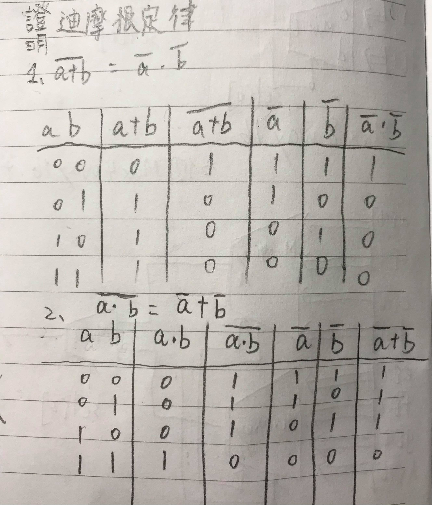

## 迪摩根定理證明

## Not16
* code
<pre>
// This file is part of www.nand2tetris.org
// and the book "The Elements of Computing Systems"
// by Nisan and Schocken, MIT Press.
// File name: projects/01/Not16.hdl

/**
 * 16-bit Not:
 * for i=0..15: out[i] = not in[i]
 */

CHIP Not16 {
    IN in[16];
    OUT out[16];

    PARTS:
    // Put your code here:
    Not(in = in[0],out = out[0]);
    Not(in = in[1],out = out[1]);
    Not(in = in[2],out = out[2]);
    Not(in = in[3],out = out[3]);
    Not(in = in[4],out = out[4]);
    Not(in = in[5],out = out[5]);
    Not(in = in[6],out = out[6]);
    Not(in = in[7],out = out[7]);
    Not(in = in[8],out = out[8]);
    Not(in = in[9],out = out[9]);
    Not(in = in[10],out = out[10]);
    Not(in = in[11],out = out[11]);
    Not(in = in[12],out = out[12]);
    Not(in = in[13],out = out[13]);
    Not(in = in[14],out = out[14]);
    Not(in = in[15],out = out[15]);    
}
</pre>

## And16

* code
<pre>
// This file is part of www.nand2tetris.org
// and the book "The Elements of Computing Systems"
// by Nisan and Schocken, MIT Press.
// File name: projects/01/And16.hdl

/**
 * 16-bit bitwise And:
 * for i = 0..15: out[i] = (a[i] and b[i])
 */

CHIP And16 {
    IN a[16], b[16];
    OUT out[16];

    PARTS:
    // Put your code here:
    And(a = a[0],b = b[0],out = out[0]);
    And(a = a[1],b = b[1],out = out[1]);
    And(a = a[2],b = b[2],out = out[2]);
    And(a = a[3],b = b[3],out = out[3]);
    And(a = a[4],b = b[4],out = out[4]);
    And(a = a[5],b = b[5],out = out[5]);
    And(a = a[6],b = b[6],out = out[6]);
    And(a = a[7],b = b[7],out = out[7]);
    And(a = a[8],b = b[8],out = out[8]);
    And(a = a[9],b = b[9],out = out[9]);
    And(a = a[10],b = b[10],out = out[10]);
    And(a = a[11],b = b[11],out = out[11]);
    And(a = a[12],b = b[12],out = out[12]);
    And(a = a[13],b = b[13],out = out[13]);
    And(a = a[14],b = b[14],out = out[14]);
    And(a = a[15],b = b[15],out = out[15]);
}
</pre>

## Or16

* code
<pre>
// This file is part of www.nand2tetris.org
// and the book "The Elements of Computing Systems"
// by Nisan and Schocken, MIT Press.
// File name: projects/01/Or16.hdl

/**
 * 16-bit bitwise Or:
 * for i = 0..15 out[i] = (a[i] or b[i])
 */

CHIP Or16 {
    IN a[16], b[16];
    OUT out[16];

    PARTS:
    // Put your code here:
    Or(a = a[0],b = b[0], out = out[0]);
    Or(a = a[1],b = b[1], out = out[1]);
    Or(a = a[2],b = b[2], out = out[2]);
    Or(a = a[3],b = b[3], out = out[3]);
    Or(a = a[4],b = b[4], out = out[4]);
    Or(a = a[5],b = b[5], out = out[5]);
    Or(a = a[6],b = b[6], out = out[6]);
    Or(a = a[7],b = b[7], out = out[7]);
    Or(a = a[8],b = b[8], out = out[8]);
    Or(a = a[9],b = b[9], out = out[9]);
    Or(a = a[10],b = b[10], out = out[10]);
    Or(a = a[11],b = b[11], out = out[11]);
    Or(a = a[12],b = b[12], out = out[12]);
    Or(a = a[13],b = b[13], out = out[13]);
    Or(a = a[14],b = b[14], out = out[14]);
    Or(a = a[15],b = b[15], out = out[15]);
}
</pre>

## Mux16

* code
<pre>
// This file is part of www.nand2tetris.org
// and the book "The Elements of Computing Systems"
// by Nisan and Schocken, MIT Press.
// File name: projects/01/Mux16.hdl

/**
 * 16-bit multiplexor: 
 * for i = 0..15 out[i] = a[i] if sel == 0 
 *                        b[i] if sel == 1
 */

CHIP Mux16 {
    IN a[16], b[16], sel;
    OUT out[16];

    PARTS:
    // Put your code here:
    Mux(sel = sel,a = a[0],b = b[0],out = out[0]);
    Mux(sel = sel,a = a[1],b = b[1],out = out[1]);
    Mux(sel = sel,a = a[2],b = b[2],out = out[2]);
    Mux(sel = sel,a = a[3],b = b[3],out = out[3]);
    Mux(sel = sel,a = a[4],b = b[4],out = out[4]);
    Mux(sel = sel,a = a[5],b = b[5],out = out[5]);
    Mux(sel = sel,a = a[6],b = b[6],out = out[6]);
    Mux(sel = sel,a = a[7],b = b[7],out = out[7]);
    Mux(sel = sel,a = a[8],b = b[8],out = out[8]);
    Mux(sel = sel,a = a[9],b = b[9],out = out[9]);
    Mux(sel = sel,a = a[10],b = b[10],out = out[10]);
    Mux(sel = sel,a = a[11],b = b[11],out = out[11]);
    Mux(sel = sel,a = a[12],b = b[12],out = out[12]);
    Mux(sel = sel,a = a[13],b = b[13],out = out[13]);
    Mux(sel = sel,a = a[14],b = b[14],out = out[14]);
    Mux(sel = sel,a = a[15],b = b[15],out = out[15]);
}
</pre>

## Or8Way

* code
<pre>
// This file is part of www.nand2tetris.org
// and the book "The Elements of Computing Systems"
// by Nisan and Schocken, MIT Press.
// File name: projects/01/Or8Way.hdl

/**
 * 8-way Or: 
 * out = (in[0] or in[1] or ... or in[7])
 */

CHIP Or8Way {
    IN in[8];
    OUT out;

    PARTS:
    // Put your code here:

    Or(a = in[0] , b = in[1] , out = or01);
    Or(a = in[2] , b = in[3] , out = or23);
    Or(a = or01 , b = or23 , out = or0123);
    Or(a = in[4] , b = in[5] , out = or45);
    Or(a = in[6] , b = in[7] , out = or67);
    Or(a = or45 , b = or67 , out = or4567);
    Or(a = or0123 , b = or4567 , out = out);
    
    
}
</pre>

## Mux4Way16

* code
<pre>
// This file is part of www.nand2tetris.org
// and the book "The Elements of Computing Systems"
// by Nisan and Schocken, MIT Press.
// File name: projects/01/Mux4Way16.hdl

/**
 * 4-way 16-bit multiplexor:
 * out = a if sel == 00
 *       b if sel == 01
 *       c if sel == 10
 *       d if sel == 11
 */

CHIP Mux4Way16 {
    IN a[16], b[16], c[16], d[16], sel[2];
    OUT out[16];

    PARTS:
    // Put your code here:
    Mux16(a = a , b = b , sel = sel[0],out = ab);
    Mux16(a = c , b = d, sel = sel[0], out = cd);
    Mux16(a = ab , b = cd ,sel = sel[1],out = out);
}
</pre>

## Mux8Way16

* code
<pre>
// This file is part of www.nand2tetris.org
// and the book "The Elements of Computing Systems"
// by Nisan and Schocken, MIT Press.
// File name: projects/01/Mux8Way16.hdl

/**
 * 8-way 16-bit multiplexor:
 * out = a if sel == 000
 *       b if sel == 001
 *       etc.
 *       h if sel == 111
 */

CHIP Mux8Way16 {
    IN a[16], b[16], c[16], d[16],
       e[16], f[16], g[16], h[16],
       sel[3];
    OUT out[16];

    PARTS:
    // Put your code here:
    Mux4Way16(a = a, b = b , c = c , d = d,sel  = sel[0..1],out = abcd);
    Mux4Way16(a = e , b = f , c = g , d = h,sel = sel[0..1] ,out = efgh);
    Mux16(a = abcd , b = efgh, sel = sel[2],out = out);
}
</pre>

## DMux4Way

* code
<pre>
// This file is part of www.nand2tetris.org
// and the book "The Elements of Computing Systems"
// by Nisan and Schocken, MIT Press.
// File name: projects/01/DMux4Way.hdl

/**
 * 4-way demultiplexor:
 * {a, b, c, d} = {in, 0, 0, 0} if sel == 00
 *                {0, in, 0, 0} if sel == 01
 *                {0, 0, in, 0} if sel == 10
 *                {0, 0, 0, in} if sel == 11
 */

CHIP DMux4Way {
    IN in, sel[2];
    OUT a, b, c, d;

    PARTS:
    // Put your code here:
    DMux(in = in,sel  = sel[1],a = DMUX1,b = DMUX2);
    DMux(in = DMUX1,sel = sel[0],a = a,b = b);
    DMux(in = DMUX2 , sel = sel[0],a = c,b= d);
}

</pre>

## DMux8Way

* code
<pre>
// This file is part of www.nand2tetris.org
// and the book "The Elements of Computing Systems"
// by Nisan and Schocken, MIT Press.
// File name: projects/01/DMux8Way.hdl

/**
 * 8-way demultiplexor:
 * {a, b, c, d, e, f, g, h} = {in, 0, 0, 0, 0, 0, 0, 0} if sel == 000
 *                            {0, in, 0, 0, 0, 0, 0, 0} if sel == 001
 *                            etc.
 *                            {0, 0, 0, 0, 0, 0, 0, in} if sel == 111
 */

CHIP DMux8Way {
    IN in, sel[3];
    OUT a, b, c, d, e, f, g, h;

    PARTS:
    // Put your code here:
    DMux(in = in, sel = sel[2],a = a1,b = b1);
    DMux4Way(in = a1,sel = sel[0..1],a = a,b = b,c = c,d =d);
    DMux4Way(in = b1,sel = sel[0..1],a = e,b =f,c = g,d = h);
}
</pre>

</html>