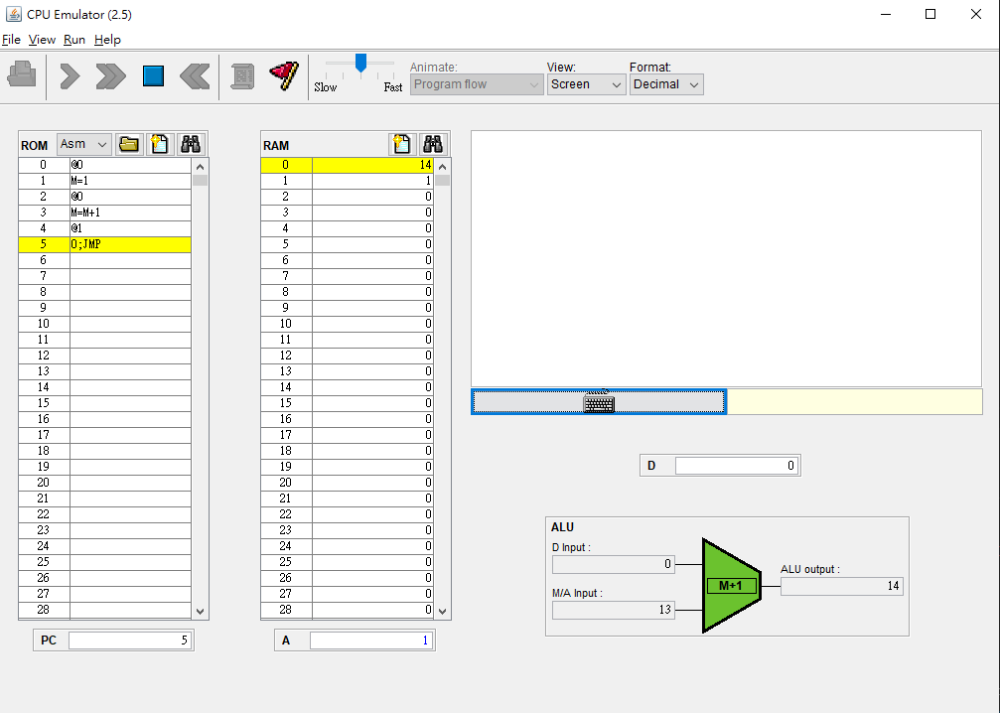

* code 
<pre>
#include<stdio.h>
int main(){
    int R0=1;
    // @0
    //M=1

    LOOP:
        R0=R0+1;//M=M+1
        printf("R0=%d\n",R0);
        goto LOOP;
    EXIT:
        return 0;
}
</pre>

